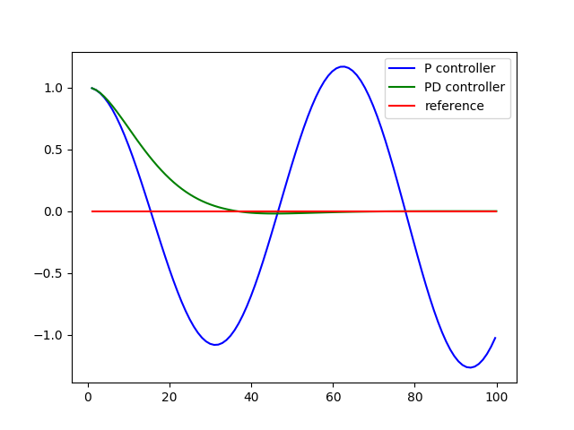

# **PID CONTROL PROJECT** 

## The goal of this project are the following:
* This project main goal is to implement a PID controller in C++ to safely maneuver the vehicle around the track.
* The simulator provides the cross track error (CTE) and the velocity (mph) in order to compute the appropriate steering angle.
* Build a PID controller and tune the PID hyperparameters by applying the general processing flow.
* Summarize the PID controller in a writeup.

My github repo for this project : [project code](https://github.com/amundada2310/CarND-PID-Control-Project)

## Writeup flow
* First I will explain the PID controller basics.
* Later dive into the project details related to PID controller

## Explaning PID Controller
* PID controller uses control loop feedback mechanism which is used to control the steering, break, throttle of the self driving car.
* PID Controller consists of 3 terms P-Proportional, I-Integral, D-Derivative controller, each of the 3 have there own importance.
* Along with performing robustly, they are also simple to program and handle.
* The basic idea behind a PID controller is to read a sensor, then compute the desired actuator output by calculating proportional, integral, and derivative responses and summing those three components to compute the output.
* Block diagram for basic PID algorithm is given below

##### P Proportional Controller- 
* To follow the reference track our car needs to steer in proportional to the cross track error.
* But this leads to marginally stability issue in simple words overshooting.

* Formula used to calculate steering angle using the Proportional controller -

                                ''' 

                                steer = -tau * cte 

                                here, tau is the gain Kp

                                '''
* Kp proportional gain needs to set in such a manner that we could minimize the oscillations.

##### PD Proportional-Derivative Controller- 
* Introducing the Derivative part helps to avoid the overshoots.
* The result of adding derivative term - the cross track error will reduce, the car will gradually reach the reference trajectory and will not overshoot, avoiding oscillations.

* Formula used to calculate steering angle using the Proportional- Derivative controller

                                '''

                                diff_cte = (cte - prev_cte)/delta_t
                                steer = -tau_p * cte - tau_d * diff_cte

                                here tau_d is the Kd and tau_p is the Kp
                                here diff_cte is the differnce between the previous cte and the recent cte and delta_t is the differnce in t-1 to t.

                                '''
* Kp proportional gain needs to set in such a manner that we could minimize the oscillations.
* Kd derivative gain needs to set in such a manner that we can avoid overshooting but reach the reference trajectory as soon as possible.

##### Systematic Bias-
* Systematic bias get introduced if suppose the car steering wheels are not alligned correctly, this could lead into issues and we will not be able to follow the reference trajectory.
* In such case the result of our PD controller will look as below-

##### PID Proportional-Integral-Derivative Controller-
* In order to compensate with the issues of the bias we will need to start steering more towards our reference, and for doing this we need to introduce an Integral term.

*  Formula used to calculate steering angle using the Proportional-Integral-Derivative Controller

                                '''

                                diff_cte = cte - prev_cte
                                prev_cte = cte
                                int_cte += cte
                                steer = -tau_p * cte - tau_d * diff_cte - tau_i * int_cte

                                here tau_d is the Kd and tau_p is the Kp and tau_i is the Ki
                                here int_cte is the summation of cte from time t=0 to t.

                                '''
* Kp proportional gain needs to set in such a manner that we could minimize the oscillations.
* Kd derivative gain needs to set in such a manner that we can avoid overshooting but reach the reference trajectory as soon as possible.
* Ki integral gain needs to set in such a manner that we could avoid the systematic bias if any.

## Explaning PID Controller - Project Details
* In this project as explained above I used the same concept of PID controller to control the car steering by minimizing the cross track error and allowing the carto follow the reference tracjectory.
* I performed the project in 2 ways -
* 1. By just controlling the steering angle and throttle was set constant at 0.3 - Only steering angle PID controller
* 2. By controlling both the steering angle as well as throttle - Steering angle and Throttle PID controller.
* Code for the project is as below -
* 1. pid.cpp file where I implemented the formulas to calculate the cte and the resulting steering angles value and throttle value-

                                    '''

                                    void PID::UpdateError(double cte) 
                                    {
                                      /**
                                       * TODO: Update PID errors based on cte.
                                       */
                                      double prev_cte = p_error;

                                      p_error  = cte;
                                      i_error  = i_error + cte;
                                      d_error  = cte - prev_cte;
                                    }

                                    double PID::Total_Error_Steer() 
                                    {
                                       /**
                                       * TODO: Calculate total error for steering using PID control
                                       */
                                      double error_steer = (-Kp*p_error) - (Ki*i_error) - (Kd*d_error);

                                      return error_steer;
                                    }

                                    double PID::Total_Error_Throttle(double max_throttle)
                                    {
                                       /**
                                       * TODO: Calculate total error for throttle using PID control and max throttle limited to
                                       */
                                      double error_throttle = max_throttle - Kp*p_error - Ki*i_error - Kd*d_error;

                                      return error_throttle;
                                    }

                                    '''

                                    * 2. main.cpp file where I implemented the 2 controllers 1. Only Steering value control 2. Steering and Throttle value control
                                    * 2.1 Only Steering value control - 

                                    '''

                                      //initialized the PID controller

                                      PID pid;

                                      /**
                                       * TODO: Initialize the pid variable.
                                       */
                                      //1. For controlling steering initializing
                                      pid.Init(0.1, 0.001, 2.0);

                                      h.onMessage([&pid](uWS::WebSocket<uWS::SERVER> ws, char *data, size_t length, 
                                                         uWS::OpCode opCode) {
                                        // "42" at the start of the message means there's a websocket message event.
                                        // The 4 signifies a websocket message
                                        // The 2 signifies a websocket event
                                        if (length && length > 2 && data[0] == '4' && data[1] == '2') {
                                          auto s = hasData(string(data).substr(0, length));

                                          if (s != "") {
                                            auto j = json::parse(s);

                                            string event = j[0].get<string>();

                                            if (event == "telemetry") {
                                              // j[1] is the data JSON object
                                              double cte = std::stod(j[1]["cte"].get<string>());
                                              double speed = std::stod(j[1]["speed"].get<string>());
                                              double angle = std::stod(j[1]["steering_angle"].get<string>());

                                              // 2. variable to store the new steer
                                              double steer_value;

                                               /**
                                               * TODO: Calculate steering value here, remember the steering value is
                                               *   [-1, 1].
                                               * NOTE: Feel free to play around with the throttle and speed.
                                               *   Maybe use another PID controller to control the speed!
                                               */

                                             // 3. PID steering controller get crosstrackerror for each component P,I and D
                                              pid.UpdateError(cte);

                                              // 4. PID steering controller get maximum total error
                                              steer_value = pid.Total_Error_Steer();

                                              // 5. DEBUG and print output steering values
                                              std::cout << "CTE: " << cte << " Steering Value: " << steer_value << std::endl;

                                              json msgJson;
                                              msgJson["steering_angle"] = steer_value;
                                              msgJson["throttle"] = 0.3;///keeping throttle constant here

                                    '''

* 2.2 Steering and Throttle value control

                                  '''

                                     */
                                    //1. For controlling steering initializing
                                    /* pid_steer.Init(0.12, 0.001, 2.975);
                                    //2. For controlling throttle initializing
                                    pid_throttle.Init(0.35, 0.000, 0.5);

                                    h.onMessage([&pid_steer, &pid_throttle](uWS::WebSocket<uWS::SERVER> ws, char *data, size_t length, 
                                                       uWS::OpCode opCode) {
                                      // "42" at the start of the message means there's a websocket message event.
                                      // The 4 signifies a websocket message
                                      // The 2 signifies a websocket event
                                      if (length && length > 2 && data[0] == '4' && data[1] == '2') {
                                        auto s = hasData(string(data).substr(0, length));
                                        if (s != "") {
                                          auto j = json::parse(s);
                                          string event = j[0].get<string>();
                                          if (event == "telemetry") {
                                            // j[1] is the data JSON object
                                            double cte = std::stod(j[1]["cte"].get<string>());
                                            double speed = std::stod(j[1]["speed"].get<string>());
                                            double angle = std::stod(j[1]["steering_angle"].get<string>());

                                            // 3. variable to store the new steer and throttle values
                                            double steer_value;
                                            double throttle_value;*/

                                             /**
                                             * TODO: Calculate steering value here, remember the steering value is
                                             *   [-1, 1].
                                             * NOTE: Feel free to play around with the throttle and speed.
                                             *   Maybe use another PID controller to control the speed!
                                             */

                                           /* // 4. PID steering controller get crosstrackerror for each component P,I and D
                                            pid_steer.UpdateError(cte);
                                            // 5. PID steering controller get maximum total error
                                            steer_value = pid_steer.Total_Error_Steer();
                                            // 6. PID throttle controller 

                                            double max_throttle = 0.7;
                                            // 7. PID throttle controller get crosstrackerror for each component P,I and D
                                            pid_throttle.UpdateError(fabs(cte));
                                            // 8. PID throttle controller get maximum total error
                                            throttle_value = pid_throttle.Total_Error_Throttle(max_throttle);
                                            // DEBUG
                                            std::cout << "CTE: " << cte << " Steering Value: " << steer_value << std::endl;

                                            std::cout << "CTE: " << cte << " Throttle Value: " << throttle_value << std::endl;          
                                            json msgJson;
                                            msgJson["steering_angle"] = steer_value;
                                            msgJson["throttle"] = throttle_value;

                                  '''

* The gains for each of the above controllers were set manually
* 1. I first started with just proportional P term and observed the behavior our the car, it was oscillating alot and was going off the track during turns.
* 2. Then I tuned the P and D terms and observed the behavior was pretty good and car was following the track quite well.
* 3. Finally I introduced the I term to remove if there were any systematic biases.
* 4. The gain setting for 1. PID controller was easy and was not time consuming, where as the 2. PID controller took little time for fine tunning.
* 5. For both the PID controller I almost tried with various different combiations and finally selected the one which was following track without falling off the lanes.
* 6. The final values for the gains:
* 6.1 PID Controller 1  - pid.Init(0.1, 0.001, 2.0); // for steering only
* 6.2 PID Controller 2 - pid_steer.Init(0.12, 0.001, 2.975); pid_throttle.Init(0.35, 0.000, 0.5); // for steering followed by the throttle

* Improvements-
Techniques like twiddle will help to fine tune the gain paramters more.

